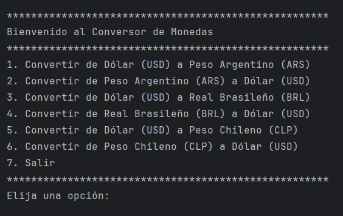

# 🪙 Conversor de Monedas 💹

¡Bienvenido al Conversor de Monedas! Una aplicación de consola elegante y eficiente desarrollada en Java que te permite obtener tasas de cambio actualizadas y realizar conversiones entre diversas divisas de forma sencilla.

## ✨ Características Principales ✨

* ↔️ **Conversión Bidireccional:** Realiza conversiones entre Dólares (USD), Pesos Argentinos (ARS), Reales Brasileños (BRL) y Pesos Chilenos (CLP).
* 📊 **Tasas Actualizadas:** Utiliza la [ExchangeRate-API](https://www.exchangerate-api.com) para obtener tasas de cambio en tiempo real.
* 💻 **Interfaz Amigable:** Menú interactivo en la consola para una fácil navegación y uso.
* 🔑 **Seguridad:** Configuración segura de tu API Key mediante variables de entorno, protegiendo tus credenciales.
* 💡 **Educativo:** Un excelente proyecto para entender cómo consumir APIs REST y parsear JSON en Java.

## 📋 Prerrequisitos

Antes de empezar, asegúrate de tener instalado lo siguiente:

* ☕ **Java JDK:** Versión 17 o superior es recomendada. Puedes descargarlo desde [Oracle JDK](https://www.oracle.com/java/technologies/downloads/) o [OpenJDK](https://openjdk.java.net/).
* Ⓜ️ **Build system:** Utilizar el de IntelliJ, Maven o Gradle, según la configuración de tu proyecto para gestionar las dependencias y la compilación del proyecto.
* 🔑 **API Key de ExchangeRate-API:** Necesitarás una clave válida para que la aplicación pueda acceder a los datos de las tasas de cambio.

## 🔑 Configuración de la API Key

La aplicación necesita una API Key de [ExchangeRate-API](https://www.exchangerate-api.com) para funcionar.

1.  **Obtén tu API Key:**
    * Visita [ExchangeRate-API](https://www.exchangerate-api.com) y regístrate para obtener una API Key. Ofrecen un plan gratuito que es suficiente para este proyecto.

2.  **Configura la Variable de Entorno:**
    La aplicación espera que la API key esté disponible como una variable de entorno llamada `EXCHANGE_RATE_API_KEY`. Así es como puedes configurarla:

    * **Opción 1: En tu sistema operativo (Recomendado para uso general):**
        * **Linux/macOS:** Abre tu terminal y ejecuta:
            ```bash
            export EXCHANGE_RATE_API_KEY="TU_API_KEY_AQUI"
            ```
            (Para que sea permanente, añade esta línea a tu archivo `~/.bashrc`, `~/.zshrc` o similar).
        * **Windows:** Abre PowerShell como administrador y ejecuta:
            ```powershell
            [System.Environment]::SetEnvironmentVariable('EXCHANGE_RATE_API_KEY', 'TU_API_KEY_AQUI', 'User')
            ```
            (O puedes configurarla a través de las "Variables de entorno" en las propiedades avanzadas del sistema. Recuerda reiniciar tu terminal o IDE después de esto).

    * **Opción 2: En IntelliJ IDEA (Ideal para desarrollo):**
        1.  Ve a `Run` > `Edit Configurations...`.
        2.  Selecciona la configuración de ejecución para tu clase `Principal`.
        3.  En el campo `Environment variables`, haz clic en el icono de la carpeta o en `...` y añade una nueva variable:
            * **Name:** `EXCHANGE_RATE_API_KEY`
            * **Value:** `TU_API_KEY_AQUI`
        4.  Haz clic en `OK` y luego en `Apply`.

    **IMPORTANTE:** Reemplaza `TU_API_KEY_AQUI` con la clave real que obtuviste de ExchangeRate-API.

    Una vez configurada, la aplicación usará esta clave para realizar las solicitudes a la API. Por ejemplo, una URL de solicitud se verá así:
    `https://v6.exchangerate-api.com/v6/TU_API_KEY_AQUI/latest/USD`

## 🚀 Cómo Ejecutar la Aplicación

1.  **Clona el Repositorio:**
    ```bash
    git clone https://github.com/ezef86/ConversorDeMonedas.git
    cd https://github.com/ezef86/ConversorDeMonedas.git
    ```

2.  **Configura la API Key:** Asegúrate de haber configurado la variable de entorno `EXCHANGE_RATE_API_KEY` como se describe en la sección anterior.

3.  **Compila y Ejecuta (usando Maven como ejemplo):**
    * **Compila el proyecto:**
        ```bash
        mvn clean package
        ```
    * **Ejecuta el JAR generado:**
        ```bash
        java -jar target/CurrencyConverter-1.0-SNAPSHOT.jar
        ```
        (El nombre del archivo JAR puede variar según la configuración de tu `pom.xml`).

    * **Alternativamente, desde IntelliJ IDEA:**
        1.  Abre el proyecto en IntelliJ IDEA.
        2.  Asegúrate de que la API Key esté configurada en las variables de entorno de tu "Run Configuration".
        3.  Ejecuta la clase `Principal.java` (o la clase que contenga tu método `main`).

## ▶️ Ejemplo de Uso

Una vez que la aplicación esté en ejecución, verás un menú interactivo en la consola:

